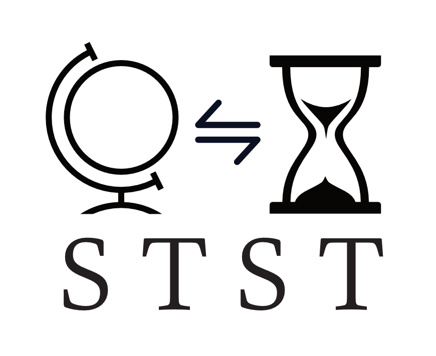
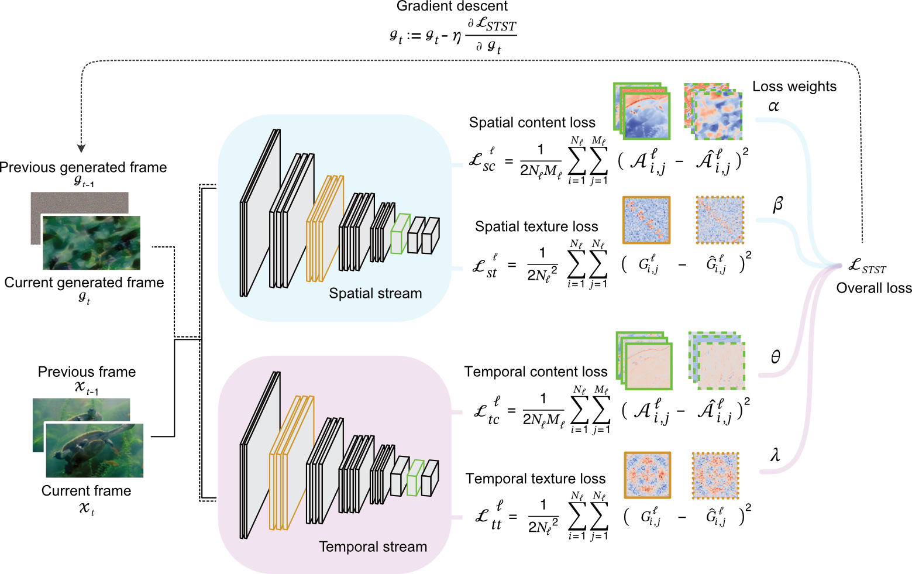

<p align="center">

</p>

|Paper | Preprint  | Code Release | 
|------|-----------|---------|
| |[](https://doi.org/10.48550/arXiv.2403.04940) | [](https://doi.org/10.5281/zenodo.14168470) |


# Spatiotemporal Style Transfer (STST)
The STST algorithm is a dynamic visual stimulus generation framework designed for vision research. 
It is based on a two-stream deep neural network model that factorizes spatial and temporal features to generate dynamic visual stimuli whose model layer activations are matched to those of input videos. These generated "model metamers" are dynamic stimuli that can be invariant to content and texture in both the spatial and temporal domain. In general, STST empowers vision scientists to manipulate and synthesize video stimuli for vision research in both biological and artificial systems. For more information, please check the paper!

<p align="center">

</p>

## Publication

_Paper at Nature Computational Science_\
[Greco, A., Siegel, M. A spatiotemporal style transfer algorithm for dynamic visual stimulus generation. Nat Comput Sci (2024)](https://doi.org/10.1038/s43588-024-00746-w)

_Preprint at arXiv_\
[Greco, A., & Siegel, M. (2024). A spatiotemporal style transfer algorithm for dynamic visual stimulus generation. arXiv preprint arXiv:2403.04940](https://arxiv.org/abs/2403.04940)


## Installation
Clone the repository and install dependencies, which are Python >= 3.6, OpenCV >= 4.9.0, TensorFlow >= 2.4:

``` bash
git clone https://github.com/antoninogreco/STST
cd STST
pip install -r requirements.txt
``` 
## Usage
Use the `synthesize.py` file to generate "model metamer" stimuli for object recognition, 
which match the low-level spatiotemporal features of their natural counterparts but lack their high-level semantic features.
``` bash
python synthesize.py -tar "data/Animal"
``` 
This procedure can generate dynamic stimuli like the following. For comparison, there are shown videos generated by randomizing the phase in the spatiotemporal frequency domain (STPS). Check the paper for more information.


## License
Copyright (2024-present) Antonino Greco & Markus Siegel\
STST is open source software under an Apache 2.0 license - see the LICENSE file for details.

## Citation
Please cite this code repository if you use this code in your research or work, as following:

Antonino Greco. (2024). antoninogreco/STST: STST v1.0 (v1.0). Zenodo. DOI: 10.5281/zenodo.14168471
```    
@software{antonino_greco_2024_14168471,
  author       = {Antonino Greco},
  title        = {antoninogreco/STST: STST v1.0},
  month        = nov,
  year         = 2024,
  publisher    = {Zenodo},
  version      = {v1.0},
  doi          = {10.5281/zenodo.14168471},
  url          = {https://doi.org/10.5281/zenodo.14168471}
}
```
and the associated paper:

Greco, A., Siegel, M. A spatiotemporal style transfer algorithm for dynamic visual stimulus generation. Nature Computational Science (2024). https://doi.org/10.1038/s43588-024-00746-w
``` 
@article{greco_spatiotemporal_2024,
	title = {A spatiotemporal style transfer algorithm for dynamic visual stimulus generation},
	issn = {2662-8457},
	url = {https://doi.org/10.1038/s43588-024-00746-w},
	doi = {10.1038/s43588-024-00746-w},
	journal = {Nature Computational Science},
	author = {Greco, Antonino and Siegel, Markus},
	month = dec,
	year = {2024},
}
```

## Acknowledgements
This study was supported by the European Research Council (ERC; https://erc.europa.eu/) CoG 864491 (M.S) and by the German Research Foundation (DFG; https://www.dfg.de/) projects 276693517 (SFB 1233) (M.S.) and SI 1332/6-1 (SPP 2041) (M.S.).

