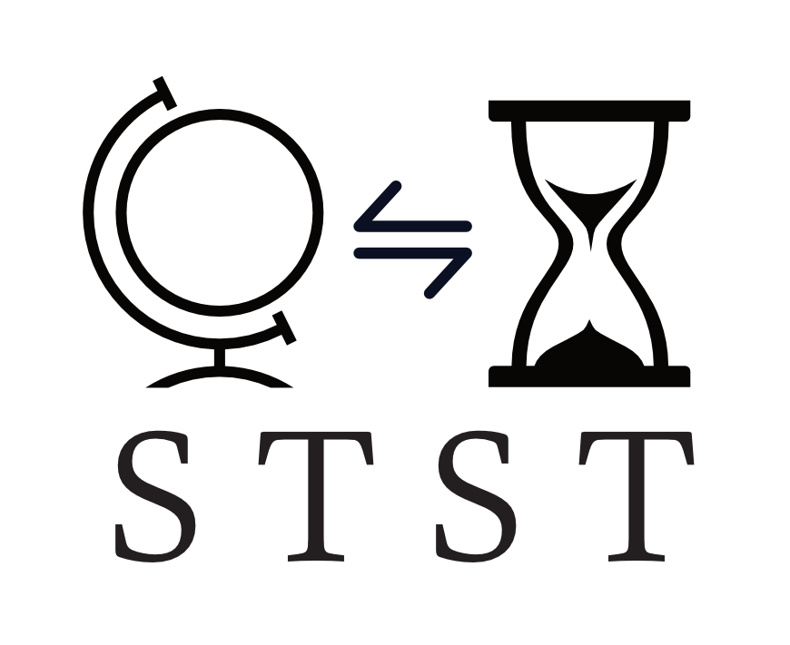
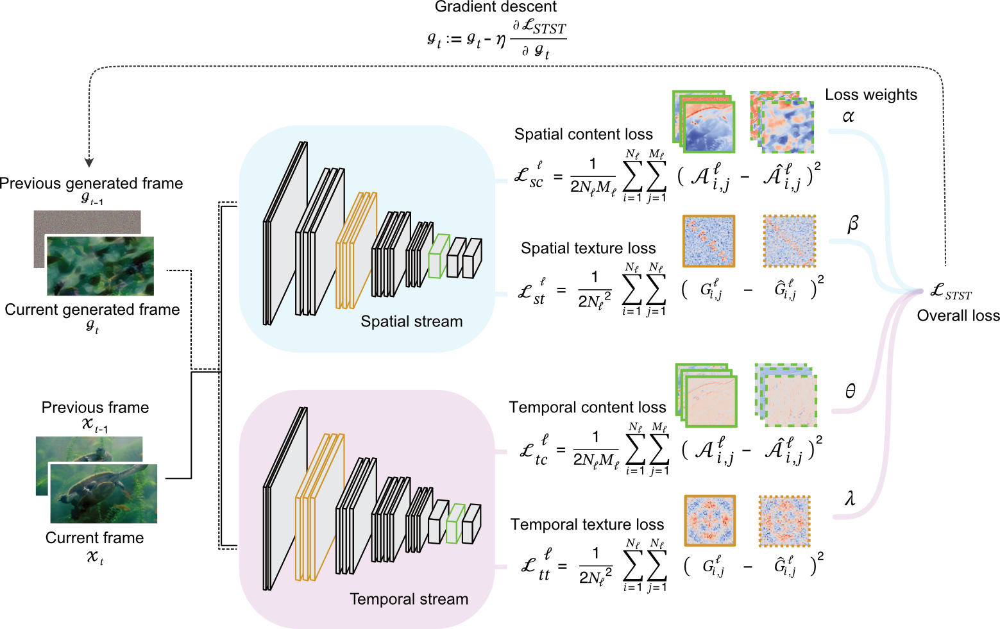

<p align="center">

</p>


# Spatiotemporal Style Transfer (STST)
The STST algorithm is a dynamic visual stimulus generation framework designed for vision research. 
It is based on a two-stream deep neural network model that factorizes spatial and temporal features to generate dynamic visual stimuli whose model layer activations are matched to those of input videos.
This makes it a powerful tool for studying object recognition and other areas of vision science in both biological and artificial systems.

<p align="center">

</p>

## Installation
Clone the repository and install dependencies, which are Python >= 3.6, OpenCV >= 4.9.0, TensorFlow >= 2.4:

``` bash
git clone https://github.com/antoninogreco/STST
cd STST
pip install -r requirements.txt
``` 
## Usage
Use the `synthesize.py` file to generate "model metamer" stimuli for object recognition, 
which match the low-level spatiotemporal features of their natural counterparts but lack their high-level semantic features.
``` bash
python synthesize.py -tar "data/Animal"
``` 

